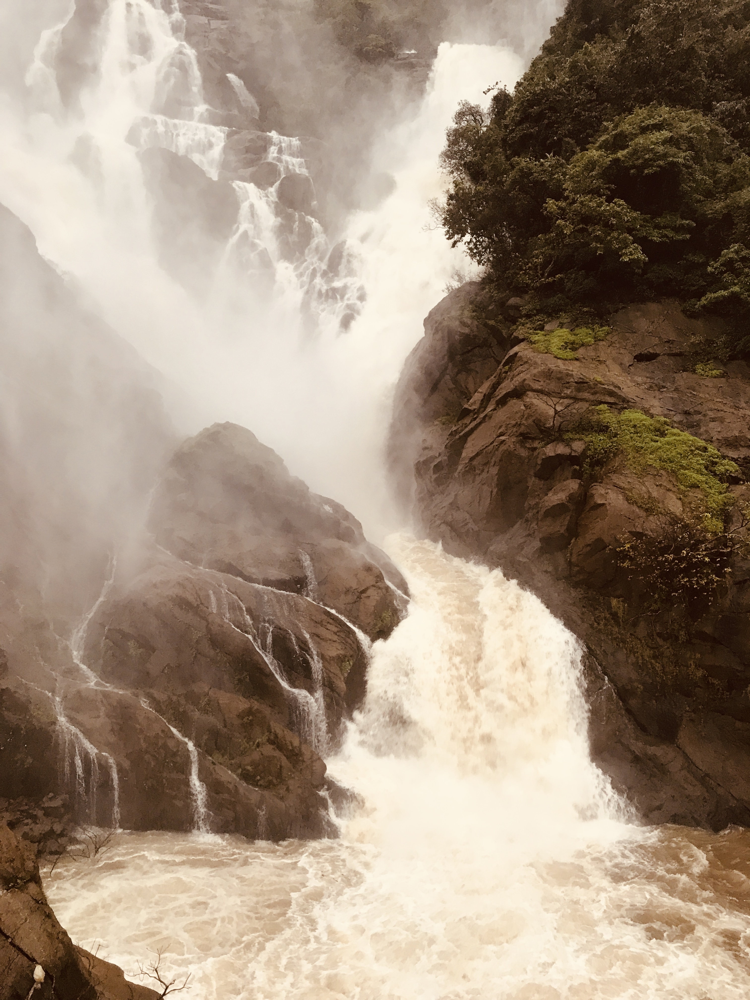

Nature has an uncanny ability to captivate our senses and transport us to a realm of wonder and awe. One such place that stands as a testament to nature's grandeur is Dudhsagar Falls, located in the heart of the Western Ghats in India. Known for its breathtaking beauty and unique charm, this cascade of milky white water is a sight to behold and an experience that will remain etched in your memory forever. Join us as we embark on a virtual journey to Dudhsagar Falls and explore the magic it has to offer.

Tucked away in the dense forests of the Bhagwan Mahavir Wildlife Sanctuary in Goa, Dudhsagar Falls is a mesmerizing four-tiered waterfall that descends from a height of around 310 meters (1017 feet). The name "Dudhsagar" translates to "Sea of Milk," aptly capturing the ethereal appearance of the waterfall as it cascades down the rocky cliffs, resembling a veil of milk pouring over the lush green landscape.

The journey to Dudhsagar Falls is an adventure in itself. Most visitors opt for a thrilling jeep safari through the dense woods and rugged terrains to reach the falls. The bumpy ride adds an element of excitement as you make your way through picturesque landscapes, crossing streams and navigating rocky paths. Alternatively, a scenic train ride offers a unique perspective, taking you right through the heart of the sanctuary and providing glimpses of the falls from a distance. For the more adventurous souls, a trek to Dudhsagar Falls presents an opportunity to immerse oneself in the unspoiled beauty of the Western Ghats. The trail winds through verdant forests, gushing streams, and quaint villages, offering a chance to connect with nature in its purest form. The highlight of the trek is the breathtaking view of the falls from up close, where you can feel the mist on your skin and hear the roar of the cascading water.

The base of Dudhsagar Falls forms a natural pool that beckons visitors to take a refreshing dip in its cool, crystal-clear waters. After the invigorating trek, there's nothing quite like the sensation of swimming beneath the majestic waterfall, surrounded by the soothing symphony of nature. It's a moment of tranquility that revitalizes both body and soul. Apart from its stunning waterfall, Dudhsagar is also a biodiversity hotspot. The surrounding sanctuary is home to a diverse range of flora and fauna, including elusive species like the Bengal tiger, Indian bison, and various species of birds and reptiles. The trek and safari offer glimpses into this vibrant ecosystem, allowing you to appreciate the interconnectedness of life on Earth.

As visitors, it's crucial to uphold responsible tourism practices to ensure that places like Dudhsagar Falls remain pristine for generations to come. Adhering to guidelines set by local authorities, respecting the environment, and minimizing our impact are small yet significant steps towards preserving the natural beauty of this enchanting destination.

Dudhsagar Falls is not just a waterfall; it's a symphony of nature, a canvas of beauty painted with water, rock, and greenery. It's a reminder of the awe-inspiring power of our planet and a call to reconnect with the wilderness. Whether you choose to marvel at its magnificence from afar, embark on a thrilling journey to its base, or dive into its refreshing waters, Dudhsagar Falls promises an experience that will leave you humbled and inspired by the wonders of the natural world.